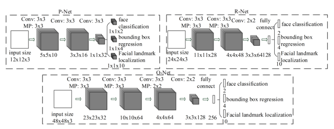
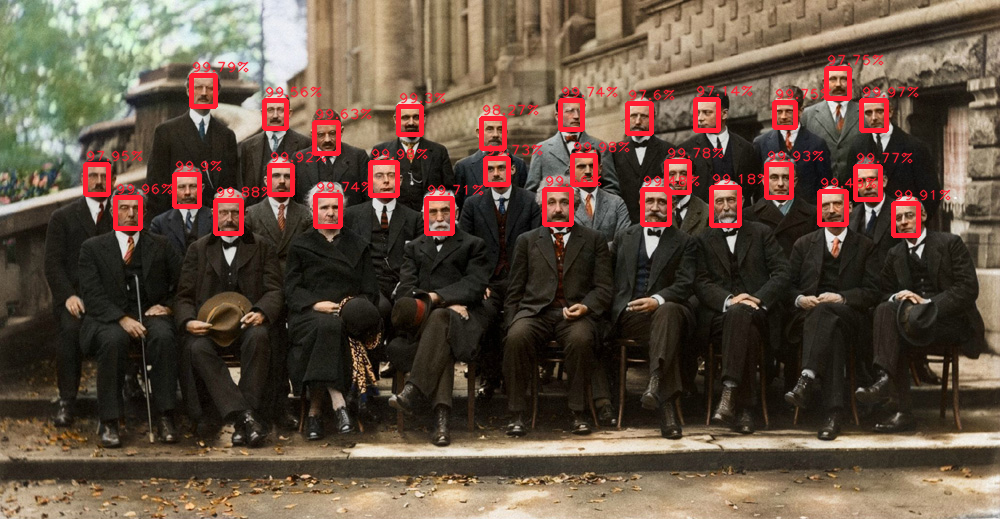

# Face detection
Face detection using Multi-task Cascaded Convolutional Networks (MTCNN)

## Main goals of this personnal project

- Get a better understanding on how CNN works and on the maths behind it.
- Use some of the things I learned in Python through my readings.

MTCNN architecture // [Source](https://arxiv.org/abs/1604.02878)



## How to run ?

You can either choose to perform face detection on a live camera feed (**1**) or on a image or video file (**2**).

Case **(1)**:
```
python face_detection.py
```
Case **(2)**:
```
python face_detection.py FILE_PATH
```
**Output example**:



## Main sources

- [Research article about MTCNN](https://arxiv.org/abs/1604.02878)
- [MTCNN implementation](https://github.com/ipazc/mtcnn)
- [MTCNN step-by-step explanation](https://towardsdatascience.com/how-does-a-face-detection-program-work-using-neural-networks-17896df8e6ff)
- [MTCNN construction explanation](https://towardsdatascience.com/face-detection-neural-network-structure-257b8f6f85d1)
